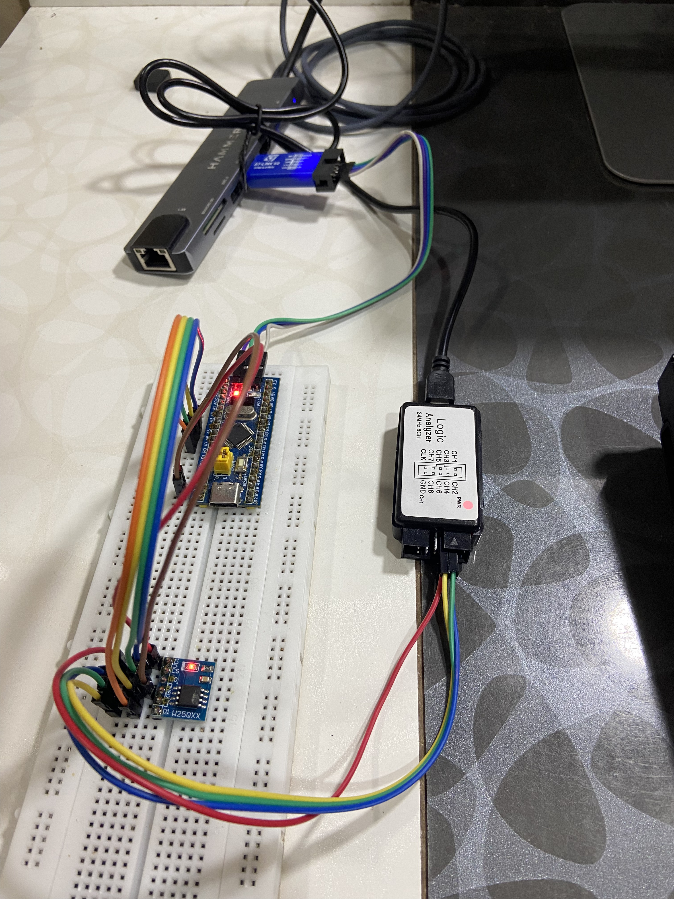

# STM32 Bare-Metal SPI Flash Driver

A bare-metal SPI NOR Flash driver for the STM32F103C8T6, written in C using register-level programming without STM32 HAL or LL dependencies.

Supports JEDEC ID read, Read Data, Page Program, and erase operations, with Status Register-1 handling, WEL verification, BUSY/WIP polling, and operation-specific timeouts.

## Features

### STM32 SPI Driver

- Bare-metal SPI1 initialization
- Register-level GPIO and SPI configuration
- SPI Mode 0 operation
- Polling-based full-duplex byte transfers
- Software-controlled chip select

### SPI Flash Driver

- JEDEC ID read and Status Register-1 access
- Read Data and Page Program commands
- 4 KB Sector Erase, 64 KB Block Erase, and Chip Erase
- Write Enable with WEL verification
- BUSY/WIP polling with operation-specific SysTick timeouts
- Multi-page write support with automatic 256-byte page-boundary handling
- Erase and write read-back verification

## Hardware

- STM32F103C8T6 Blue Pill
- Winbond W25Qxx SPI NOR Flash module
- ST-Link programmer/debugger
- Logic analyzer

## Connections

| STM32F103 | SPI Flash | Function |
|---|---|---|
| PA5 | CLK | SPI clock |
| PA6 | DO | MISO |
| PA7 | DI | MOSI |
| PA4 | CS | Chip select |
| 3.3V | VCC | Power |
| GND | GND | Ground |

## Driver Architecture

```text
Application
    |
    v
Flash device driver
    |
    v
SPI1 peripheral driver
    |
    v
STM32F103 registers
```

The SPI layer handles STM32 SPI1 configuration and byte transfers.

The Flash layer handles flash commands, 24-bit address transmission, WEL verification, page-boundary handling, BUSY/WIP polling, and operation-specific program/erase timeouts.

## Project Structure

```text
stm32-bare-metal-flash-driver
├── debugging
│   └── logic-analyzer
│       ├── page_program.png
│       ├── read_data.png
│       ├── read_jedec_id.png
│       └── wren_read_status_register.png
├── include
│   ├── flash.h
│   ├── flash_internal.h
│   ├── spi.h
│   ├── stm32f103xx.h
│   ├── systick.h
│   └── systick_internal.h
├── linker
│   └── main.ld
├── src
│   ├── flash.c
│   ├── main.c
│   ├── spi.c
│   └── systick.c
├── startup
│   └── startup.c
├── Makefile
└── README.md
```

## Public Driver API

```c
void flash_init(void);
void flash_read_jedec_id(jedec_id_t *id);
void flash_read(uint32_t address, uint8_t *buffer, uint32_t length);
flash_status_t flash_write(uint32_t address, const uint8_t *buffer, uint32_t length);
flash_status_t flash_sector_erase(uint32_t address);
flash_status_t flash_block_64KB_erase(uint32_t address);
flash_status_t flash_chip_erase(void);
```

`flash_write()` accepts an arbitrary-length buffer and splits it across Flash page boundaries internally.

## Page Programming

A Page Program command can program at most one 256-byte page.

For a write that begins in the middle of a page, `flash_write()` divides the buffer into:

```text
first partial page
        |
        v
zero or more full 256-byte pages
        |
        v
final partial page
```

Each page is programmed separately.

Before programming, the driver sends Write Enable and verifies the WEL bit in Status Register-1.

After Page Program is issued, the driver polls the BUSY/WIP bit until the Flash becomes ready or the page-program timeout expires.

## Erase Operations

The driver supports:

- 4 KB Sector Erase
- 64 KB Block Erase
- Chip Erase

Each erase operation:

1. Sends Write Enable.
2. Verifies the WEL bit.
3. Sends the erase command.
4. Polls BUSY/WIP until completion.
5. Returns a timeout status if the operation exceeds its configured maximum wait time.

## Verification

The demo application verifies both erase and write operations.

For erase verification:

```text
erase
  |
  v
read back
  |
  v
verify bytes == 0xFF
```

For write verification:

```text
generate test pattern
        |
        v
flash_write()
        |
        v
read back
        |
        v
byte-for-byte comparison
```

The write test is performed only after erase completes successfully and the erased region is verified.

## Hardware Setup



STM32F103C8T6 connected to the SPI Flash module, with ST-Link used for programming and debugging.

## Logic Analyzer Validation

The [`debugging/logic-analyzer/`](debugging/logic-analyzer/) directory contains logic analyzer captures of:

- JEDEC ID read
- Read Data
- Write Enable and Status Register-1 read
- Page Program

The Page Program capture verifies that chip select remains asserted across the command, 24-bit address, and data bytes.

## Building

Build the firmware:

```bash
make
```

Flash the firmware:

```bash
make flash
```

# Development Tools

- Arm GNU Toolchain
- GDB
- GNU Make
- st-flash
- ST-Link V2
- PulseView / Saleae Logic

## What This Project Demonstrates

- Bare-metal STM32F103 SPI programming
- SPI NOR Flash command and status handling
- Multi-page writes with page-boundary handling
- BUSY/WIP polling with operation-specific timeouts
- Erase and write read-back verification
- Logic-analyzer based protocol validation

## References

- STM32F103 reference manual
- STM32F103C8T6 datasheet
- Winbond W25Qxx SPI NOR Flash datasheet